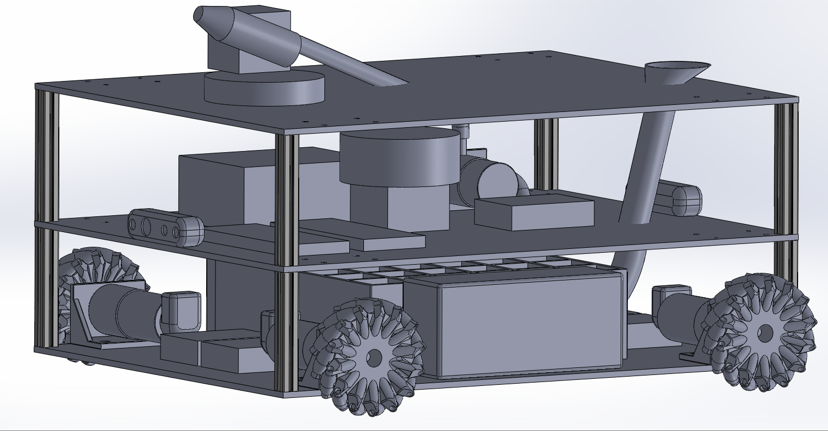
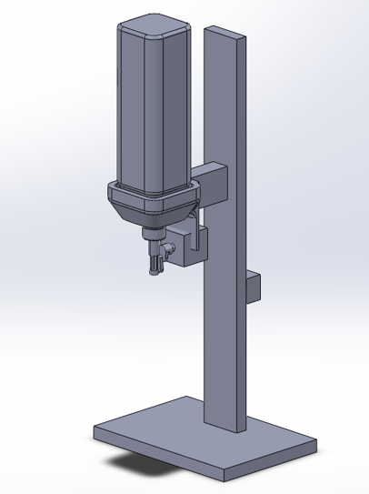
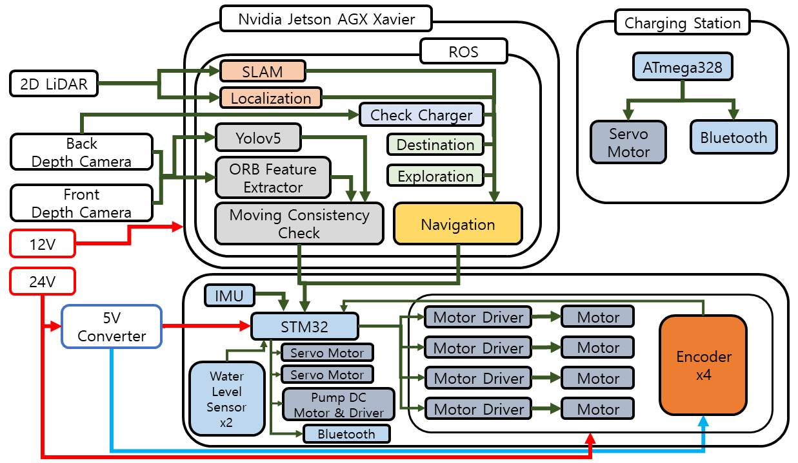

# 2022-Share_Robot_Contest
2022 share robot contest  

# Goal of Robot
Quarantine & Security Robot

# Team
## HW
[Chunggil An](https://github.com/chunggilan) : Team leader, Motor Control, Embedded System  
## SW
[Kijin Lee](https://github.com/Daidalos99) : LiDAR SLAM, ROS Programming  
[Jiwon Yang](https://github.com/ynji1) : Robot Navigation, Sensor Communication  
[Sanghyun Park](https://github.com/SanghyunPark01) : Vision System, ROS Programming
## Contributer 
[Ohyun Kwon](https://github.com/OhyunKwon99)

# Architecture
## Design
|Robot|Charging Station|
|:--:|:--:|
|

 |

 |

## System

  

# Project Code 
## Motor Control
**On Going** 

## Docking
[Yaw Estimation - Basic(non ROS)](https://github.com/SanghyunPark01/Yaw-Estimation)  
[Auto Docking System](https://github.com/SanghyunPark01/Auto-Docking-ROS)

## Dynamic Object Detection
[Dynamic Object Detection](https://github.com/SanghyunPark01/dynamic_object_detection)

## SLAM & Navigation
[Odometry](https://github.com/Daidalos99/qsbot_odometry)  
[Robot Navigation](https://github.com/Daidalos99/qsbot_navigation)

## ROS System Integration
[ROS system integration](https://github.com/SanghyunPark01/robot-core_system)

## Simulation
[Robot Simulation](https://github.com/Daidalos99/qsbot_simulation)

## Jetson GPIO ROS
[Jetson GPIO ROS](https://github.com/SanghyunPark01/jetson-gpio-ros)

# Result
**On Going**