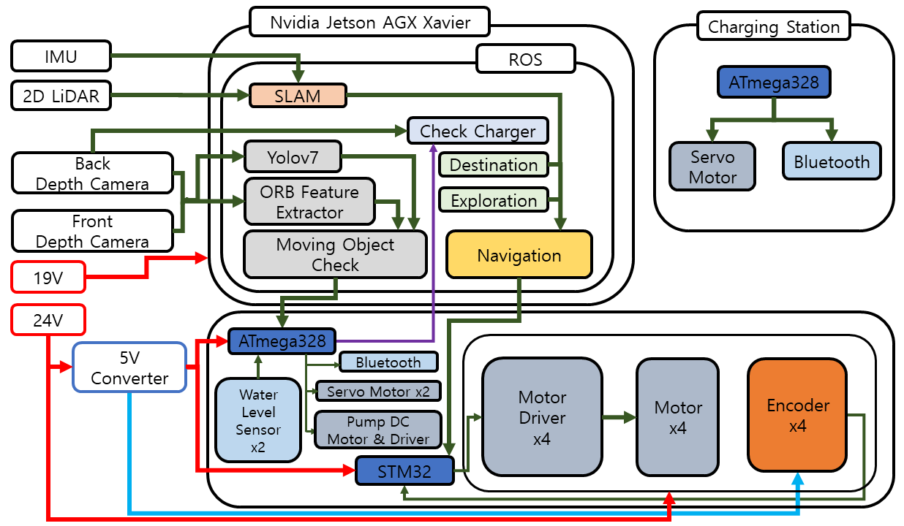

# 2022-Share_Robot_Contest
2022 share robot contest  

# Goal of Robot
Quarantine & Security Robot

# Team
## HW
[Chunggil An](https://github.com/chunggilan) : Team leader, Motor Control, Embedded System  
[Ohyun Kwon](https://github.com/OhyunKwon99) : Design, ROS Programming
## SW
[Kijin Lee](https://github.com/Daidalos99) : LiDAR SLAM, ROS Programming  
[Jiwon Yang](https://github.com/ynji1) : Robot Navigation, Sensor Communication  
[Sanghyun Park](https://github.com/SanghyunPark01) : Vision System, ROS Programming  

# Architecture
## Design
|Robot|Charging Station|
|:--:|:--:|
|

 |

 |

## System

  

# Project Code
**On Going**
# Result
**On Going**